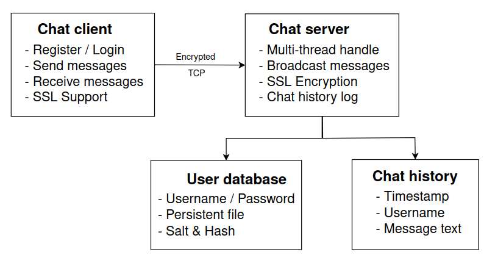
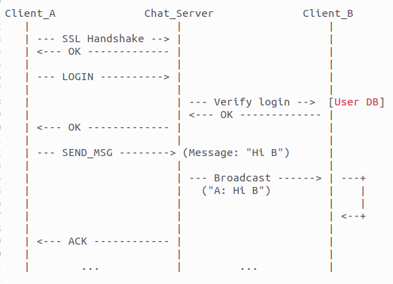

# TCP client-server secure chat app

## 1. Introduction and architecture design 

**Objective**: This system is a secure TCP-based chat application based on a client-server model, supporting multiple concurrent users. Clients can register, log in, and participate in a group chat room. All communication is encrypted using OpenSSL to ensure privacy and security. User credentials and chat history are persistently stored to maintain data across sessions

**Target platform**: Ubuntu 22.04 (64-bit)

**Port**: 4443

**Communication mode**: Chat Room - all users can se and send message in onme shared room

**Security**: All data transmissions are protected using SSL

---

## 2. Functional requirements 

- Sending and receiving messages in group
- Allow users to login / register (by enter *Username* and *Password*) 
- All the history of chat room will be stored
- Support for multiple concurrent users
- Group chat: messages are broadcast to all connected clients
- Persist all user data, sessions and chat logs after restarting the server or client

---

## 3. Non-Functional requirements 

- SSL encryption via OpenSSL.
- Multi-threaded server can handle multiple clients simultaneously.
- Data is preserved across server restarts.
- Only standard C and OpenSSL libraries are used.
- Includes Makefile for build automation.

---

## 4. Broadcast message diagram

**Description**

CLIENT --> SERVER : Initiate the SSL handshake

CLIENT --> SERVER : Send username and password

SERVER --> CLIENT : Authentication result (success or fail)

CLIENT --> SERVER : Send message text

SERVER --> ALL_CLIENTS : Broadcast message

SERVER --> DATABASE : Log message (sender id, message text, timestamp)

---

## 5. High-level module description  

| Module           | Description |
|------------------|-------------|
| `server/main.c`  | Sets up SSL context, listens for clients, and handles multi-threaded communication. |
| `client/main.c`  | Connects to server, manages user input/output, and displays chat messages. |
| `auth.c`         | Manages login and registration logic. |
| `session.c`      | Generates and validates session tokens. |
| `chat.c`         | Formats messages and broadcasts to all connected clients. |
| `ssl_utils.c`    | Handles SSL/TLS handshake and data transmission. |
| `storage.c`      | Reads/writes user info, session data, and chat logs. |

---

## 6. Data and file design

| File | Purpose |
|------|---------|
| `users.db` | Stores username and hashed password. |
| `sessions.db` | Maps session tokens to usernames. |
| `chat_history.txt` | Stores group chat logs in format: `[timestamp] username: message`. |

---

## 7. Security design

- All communication between clients and server is encrypted using OpenSSL (SSL_read, SSL_write).
- Passwords are securely stored using hash functions with salt.
- Session tokens are randomly generated and stored in sessions.db.
- Even if intercepted via tools like Wireshark, data remains unreadable.

---

## 8. Tool and library

**Tools**

    GCC (GNU Compiler Collection)
    Used to compile the C source code on Unix-based systems.

    Make
    Automates the build process using a Makefile, ensuring efficient compilation.

    GDB (GNU Debugger)
    Helpful during development and debugging multi-threaded applications.

    Visual Studio Code
    Lightweight, cross-platform code editor used with C/C++ extension for efficient coding and project management.

    Wireshark (optional)
    Used to inspect network packets and verify the encryption over SSL/TLS.

**Libraries**

    pthread (POSIX Threads)
    Enables multi-threading on the server, allowing concurrent client handling.

    OpenSSL
    Provides secure communication over TLS/SSL. Used for:

        SSL/TLS handshake

        Encryption and decryption

        Secure sockets

    SQLite (or file-based storage)
    Stores user accounts, session history, and chat logs persistently.

    Standard C Library (libc)
    Core system functions such as socket(), read(), write(), select(), etc.

---

## 9. Limitations and enhancement

--- 
